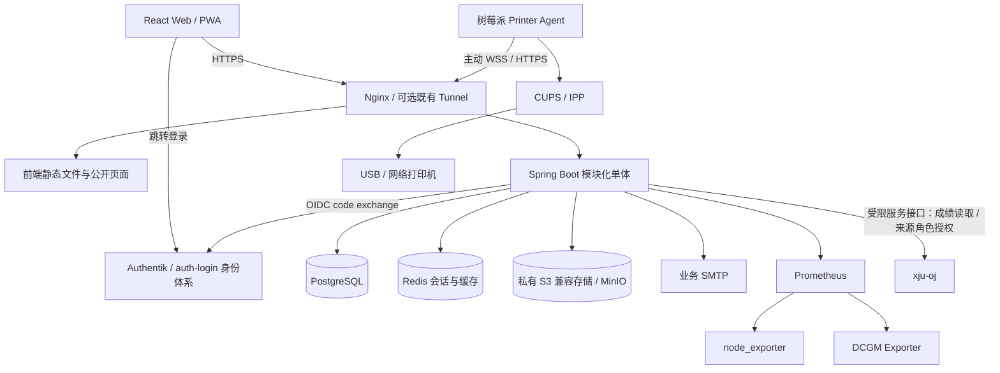

# 02 总体架构与技术选型

[返回概要计划](README.md) · [详细设计索引](../design/README.md)

> 本文为正式系统目标。当前运行独立 `frontend/` 演示，不依赖下图外部服务；`backend/` 仅有说明文件。原型依赖已安装，锁定版本见[依据](../references/README.md)，最新构建结果见[进度](../progress.md)，历史缺 CSS 问题已解决。

## 1. 部署与数据流



数据库是业务状态的权威来源；Redis 丢失不能丢任务、审批和通知。对象存储不是权限系统，所有访问经业务授权。Prometheus 原始时间序列不写入 PostgreSQL，后者只存服务器资产、告警事件和必要的聚合结果。

树莓派只需能出站访问 LabOS，不要求公网 IP，不开公网 CUPS 管理端口。监控采集使用受控内网/既有私有网络；公网 API 不直接 SSH 登录服务器。

## 2. 技术基线

| 层 | 方案 | 选择理由与限制 |
|---|---|---|
| 前端基础 | React、TypeScript、Vite、React Router | 与飞跃一致，按路由拆包 |
| UI | Tailwind + shadcn/Radix + Lucide | 用户已确认；保留飞跃 token 和组件习惯 |
| 数据/表单 | TanStack Query、Zustand、Zod、React Hook Form | 服务端状态归 Query；Zustand 仅 UI；表单单独管理 |
| HTTP | 复用 fetch 封装结构，重写会话、CSRF 与错误处理 | 不再额外引入 Axios；这是设计建议 |
| 可视化 | 工位 SVG、现有甘特图；监控曲线按需 ECharts | ECharts 延迟到 D，避免整库进首屏 |
| API | Spring Boot、Spring Security OAuth2 Client、Validation | 模块化单体；浏览器使用 Session Cookie |
| 持久化 | PostgreSQL、MyBatis-Plus、Flyway | SQL 约束明确，迁移纳入版本 |
| 会话/缓存 | Spring Session + Redis | 会话可撤销，应用可平滑重启 |
| 文件/邮件 | S3 兼容接口、MinIO 候选、Spring Mail | MinIO 发行物及维护方式在 B0 核验 |
| 异步 | PostgreSQL outbox + 后台 worker | 首版不增加消息中间件；保证事务提交后可靠重试 |
| 打印机状态端 | Python 3 + HTTPS 心跳 + 只读 CUPS 状态 | 独立进程；不下载文件或提交打印任务 |
| 监控 | Prometheus、node_exporter、DCGM Exporter | Grafana 可选，LabOS 提供业务摘要 |
| 部署 | Docker Compose、Nginx；Agent 用 systemd | 云端与硬件进程分开部署 |

### 版本冻结规则

飞跃清单是参考来源，不覆盖本仓已验证的锁文件。当前前端已经完成 token/UI 复用，B00 直接保留并验证现有依赖，不重做迁移样板；仅在兼容性或实际问题需要时升级并记录差异。具体版本见[依据](../references/README.md)。

后端默认 Java 21；Spring Boot/MyBatis-Plus 版本需在 B00 验证匹配的 starter、Security OAuth2、Session、Flyway、PostgreSQL 驱动和 OpenAPI 工具，冻结 BOM 与容器 digest。官方 [MyBatis-Plus 入门](https://baomidou.com/en/getting-started/)按 Spring Boot 分支提供集成依赖；不要混装不同代际 starter。当前文档不宣称某一版本是最新或已经通过兼容测试。

## 3. 逻辑模块

```text
identity     OIDC、成员资料、角色、导师关系、OJ 来源角色授权同步
workspace    房间、工位、分配历史
collaboration 项目、里程碑、统一任务、会议
leave        申请、审批令牌、审批记录
printer      设备登记、Agent 身份与只读状态报告
monitoring   服务器资产、固定指标查询、告警映射
assessment   培养期、OJ 单链接导入、ACM 快照与过滤排名、互斥笔试/机试、当次与综合排行、修订审计
showcase     公开内容、发布版本、下架
platform     文件、outbox、通知、审计、配置
```

每模块按 `api/application/domain/infrastructure` 分层，Controller 不直接拼 SQL 或调用设备。模块间通过服务契约调用，禁止绕过授权直接使用其他模块 Mapper。单体内本地事务覆盖业务记录、审计和 outbox；网络调用不占用业务事务。

OJ 导入和管理员同步属于独立连接器能力，使用稳定身份和受限服务凭据；LabOS 数据库与 OJ 不做跨库直接写入。管理员设置与 outbox 同事务，收到 OJ 确认才显示同步成功；详细来源角色合并、失败恢复及原有 OIDC 覆盖问题见 [11 专项](../design/11-oj-import-and-admin-sync.md)。

## 4. 建议目录（待创建）

```text
xju-lab/
  frontend/src/{api,components,features,pages,styles,stores,lib}
  backend/src/main/java/.../{identity,workspace,collaboration,...}
  backend/src/main/resources/db/migration/
  printer-agent/{src,tests,deploy}/
  contracts/{openapi.yaml,printer-protocol-v1.schema.json}
  deploy/{compose,nginx,prometheus}/
  docs/{plan,design,references}/
```

Printer Agent 首版放同仓库独立目录、独立构建与协议版本，后续可拆仓。单实验室不预造多租户框架；未来多实验室需要重新审查数据隔离，不能只加前端筛选器。

## 5. 路由和边界

- `/*`：公开展示，E 前只有简洁入口和登录链接，不显示内部假数据。
- `/app/*`：内部应用；`/app/admin/*` 管理功能。
- `/login`：统一登录引导；`/oauth2/authorization/labos`、`/login/oauth2/code/labos` 由后端处理。
- `/api/v1/*`：浏览器 API；`/api/v1/public/*` 只返回发布投影。
- `/api/agent/v1/*`、`/ws/printer/v1`：独立设备身份，不接受普通成员会话。
- `/approval/leave`：审批页面；GET 不执行审批、不消耗令牌。

以上具体部署 origin 由 `LABOS_PUBLIC_ORIGIN` 注入，尚未指定实际域名。代理优先匹配 API/OIDC/WS，再做 SPA fallback；不存在的 API 必须返回 JSON 404，不能返回 index.html。
