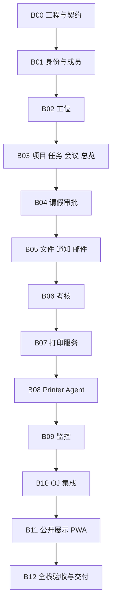

# 03 路线图与工作包映射

[概要计划](README.md) · [完整开发计划](06-backend-completion.md) · [验收](../acceptance.md)

> 当前执行顺序为 B00–B12。旧 F01–F10 中尚未完成的结构拆分、边界和浏览器检查，随业务 API 接入一起完成，不再要求每轮一步。原 A0–E 保留为需求追踪标签。

## 实施顺序

这是默认实施顺序，不表示 B09 等独立模块必须等待打印硬件到位。外部待验证的包在本地代码/测试完成后，可继续后续模块；生产验收仍保留未完成状态。

## 旧阶段与新工作包

| 原标签 | 当前工作包 | 主要证据 |
|---|---|---|
| A0.1 工程基础 | B00 | 版本冻结、空库迁移、契约、构建和 CI |
| A0.2 UI 复用 | 已有前端 + 各包增量接入 | 保持视觉、模块拆分、响应式回归 |
| A0.3 身份 | B01 | OIDC、会话/CSRF、双用户授权 |
| A0.4 OJ 角色 | B01 写期望/outbox，B10 同步 | 来源合并、撤销、乱序与旧会话 |
| A1.1 工位成员 | B01–B02 | 真实成员、并发分配、历史 |
| A1.2 项目会议 | B03 | 统一任务、权限、版本冲突 |
| A1.3 请假总览 | B03–B04 | 审批状态机、时间重叠、派生统计 |
| B 文件与通知 | B05 | 授权下载、PDF、邮件令牌、重试 |
| C 打印 | B07–B08 | 队列、Agent、CUPS、重启与未知结果 |
| D 监控 | B09 | 单位、过期、故障区分、告警恢复 |
| E.1 考核 | B06 + B10 | 权威计分、快照、单链接 OJ 导入 |
| E.2 公开展示 | B11 | 许可、发布、下架、脱敏 |
| E.3 全面质量 | B11–B12 | PWA、端到端、性能、恢复与交付 |

不沿用早期人工人日估算作为 Luna 的执行时长承诺。每包实现项、默认规则和退出条件以[完整计划](06-backend-completion.md)为准。

## 交付检查点

1. B04 后：真实数据库下的身份、工位、协作、请假与总览闭环。
2. B06 后：私有文件/通知与可追溯考核上线所需的本仓能力。
3. B10 后：打印、监控、OJ 连接器具备代码与本地故障测试；真实硬件和跨系统接入各自登记。
4. B12 后：可复现运行、全栈证据与交付文档齐全；外部未验证项清楚列出。

每个检查点都继续推进下一包，不默认暂停索取评审。只有授权范围外的外部动作需单独处理，其余工作继续。
